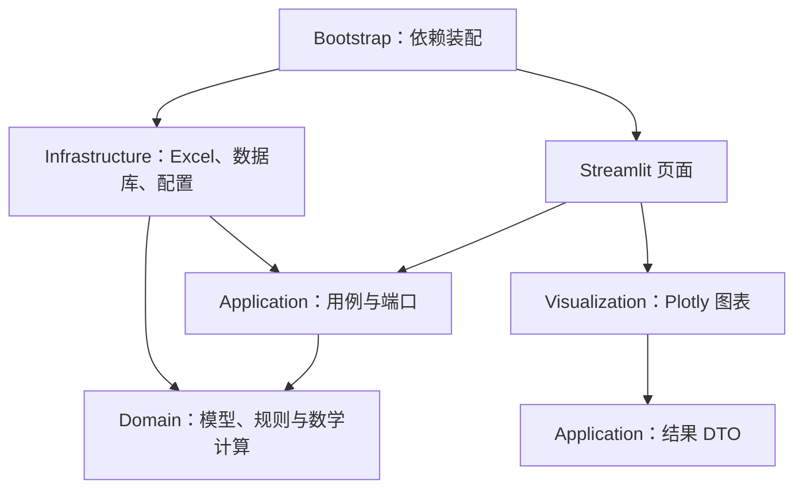
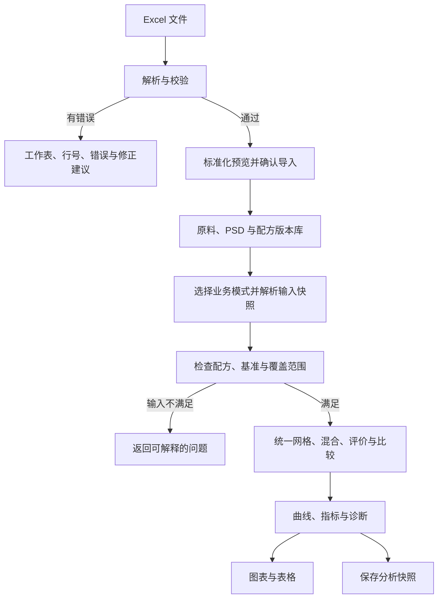

# PSD Mix Analyzer：第一阶段架构设计

版本：v1.0｜日期：2026-09-21｜状态：架构待确认，尚未进入业务代码实现。

设计依据：用户提供的《总提示词(1).md》。本文件完成其中要求的需求理解、系统边界、架构图、模块职责、数据流、数据模型、数学模型、项目目录、依赖关系和开发里程碑。

核心原则：**生产阶段固定配方，模型用于监控和分析；研发阶段才允许模拟调整比例。**

## 1. 需求理解

### 1.1 系统要回答的问题

已知各原料批次的 PSD 和已确定的配方质量比例，计算理论混合 PSD，判断原料批次或供应商变化对整体颗粒级配的影响，并保存可复算的分析记录。

本系统的直接产出是曲线、差异和描述指标。它不把 q 拟合结果转成生产配方调整指令，也不将曲线拟合优劣等同于产品性能。

| 业务模式 | 用户允许改变的输入 | 固定内容 | 主要输出 |
|---|---|---|---|
| 生产监控 | 正式配方所允许原料对应的批次、PSD 版本 | 正式配方版本、各组分比例、监控分析口径 | 混合 PSD、等效 q、关键通过率、与基准的差异 |
| 原料替代 | 指定配方位置上的候选替代批次 | 原配方比例、其余组分、比较口径 | 替代前后曲线、ΔPSD、Δq、关键粒径偏差 |
| 研发模拟 | 模拟原料和配比、独立分析参数 | 来源正式配方保持不变 | 标记为“非正式生产配方”的模拟结果 |
| 历史分析 | 检索条件、可比较的历史记录 | 已保存记录及其输入快照 | 趋势、基准比较、分析口径变化提示 |

生产监控默认使用绑定到配方版本的分析配置。若要探索其他 q 范围、Dmin/Dmax 或插值方法，应另建分析配置版本；这些结果不能混入原监控序列。

### 1.2 第一版成功标准

1. 用 Excel 导入原料批次、PSD、配方，并能定位数据错误。
2. 在无 UI 环境下完成统一粒径网格、插值、混合、模型评价与比较。
3. 正式配方不因页面操作、替代分析或模拟保存而改变。
4. 每次保存的分析能追溯至配方、批次、PSD、分析配置及算法版本。
5. 页面同时呈现 q、拟合误差、关键粒径和全曲线差异。
6. 数据不足时给出“不可计算”或“覆盖不完整”，不伪造完整曲线和 q。

## 2. 系统边界

### 2.1 第一版范围

采用单体 Python 应用：Streamlit 页面、独立数学核心、Excel 导入导出、Plotly 图表和 SQLite 持久化。初始使用场景为工程师本机或受控环境中的少量用户分析，暂不承诺大规模并发。

包含三种业务模式、历史检索与趋势、单一基准批次比较、输入模板、数据校验、分析记录导出。生产分析提交后保存；研发调整时可先预览，仅显式保存的模拟进入历史。

第一版不实现 AI/LLM、自动配方优化、设备控制、MES/ERP、性能预测、DEM、多目标优化和复杂权限。正式配方发布审批沿用现有业务流程，本工具只登记外部已批准的版本及批准依据。

历史稳定区间和 SPC 留到后续；第一版只显示历史数据和已明确配置的参考阈值，不把样本极值、简单 ±3σ 或未经验证的区间自动当作合格判据。

### 2.2 计算适用边界

- 混合结果是按给定 PSD 和比例计算的理论分布，未模拟混料中的破碎、团聚、溶解或偏析。
- 配方默认指参与 PSD 分析的干基固体组分。水、液体添加剂不直接加入颗粒配比；从实际投料量转换为干基质量必须单独记录规则。
- 所有正比例固体组分需要 PSD，不能静默删除缺失组分再归一化。
- 不同测试方法、分散条件和统计基准的数据不一定可直接比较。第一版保留元数据并执行兼容性检查。
- 若后续存在无 PSD 的微量添加物，只能另建明确命名的“部分组分分析”口径；第一版不将其结果冒充完整配方结果。

### 2.3 明确采用的设计决策

| 决策 | 原因 |
|---|---|
| 模块化单体，不拆微服务 | 便于本地运行、调试和验证，符合“小而可靠”的目标 |
| 领域层不依赖基础设施 | 换数据库、换 Excel 格式或换 UI 时，数学模型保持稳定 |
| 原料品种、批次、PSD 测量版本拆分 | 同一批次可以复测，批次变化不应导致配方改版 |
| 分析配置版本化 | q、误差与趋势的比较需要一致口径 |
| 内部单位固定为 μm、0～1、kg/m³ | 防止百分数、毫米和密度单位混用 |
| 正式版本不可覆盖，模拟另存 | 配方锁定通过业务规则实现，不能仅靠禁用按钮 |

## 3. 架构图

以下箭头表示**代码依赖方向**，不是按层逐级读写数据库的顺序。



Application 定义自己需要的 Repository、文件解析等端口；Infrastructure 实现这些端口；Bootstrap 将具体实现注入用例。Domain 不导入 Application、Infrastructure 或 UI。

附件中的 `domain → infrastructure` 不作为实际 import 方向使用，否则领域层仍会被数据库和文件系统绑定。这是本设计对原建议分层的主要调整。

运行时，用例可以通过 Repository 接口加载和保存数据；这不意味着用例要导入 SQLite 实现。

## 4. 模块职责

### 4.1 分层责任

| 模块 | 承担职责 | 不承担职责 |
|---|---|---|
| `domain/models` | PSD、配方版本、批次、配置、结果等实体与不变量 | 文件读取、数据库会话、页面状态 |
| `domain/services` | 网格、插值、统计基准转换、混合、q 拟合、误差和差异计算 | 导入文件、提交事务、操作 UI |
| `domain/policies` | 正式配方不可变、比较兼容性、数据覆盖策略 | 用户登录或角色权限系统 |
| `application/use_cases` | 加载输入、执行业务规则、调用数学服务、组装结果、控制保存事务 | 编写数学公式、直接操作 Excel 单元格 |
| `application/ports` | Repository、UnitOfWork、解析器、报告写出接口 | 具体 SQL 和文件格式实现 |
| `application/dto` | 请求、展示结果、错误及导入预览的传输对象 | ORM 模型或 Streamlit 对象 |
| `infrastructure/excel` | 表头映射、单位解析、工作表定位、模板与结果导出 | 配方锁定判断、q 计算 |
| `infrastructure/persistence` | ORM、数据库连接、迁移、事务实现 | 计算和图表 |
| `infrastructure/repositories` | 领域对象和数据库记录之间的映射 | 根据 q 修改配方 |
| `visualization` | 从图表数据生成 Plotly Figure | 重新拟合 q、重新插值、查询数据库 |
| `ui/streamlit_app` | 表单、选项、状态提示、调用用例、展示结果 | 直接调用 SQLAlchemy 或实现混合公式 |
| `bootstrap` | 配置加载、实例创建、依赖注入、日志初始化 | 新增业务规则 |

### 4.2 关键可替换接口

以下是接口契约说明，尚不是实现代码。

| 接口 | 典型输入 → 输出 | 第一版实现 |
|---|---|---|
| `PSDInterpolator` | 标准化 PSD、目标粒径、覆盖策略 → 插值值与覆盖标记 | linear、log-linear |
| `GridBuilder` | 固定分析配置 → 粒径网格 | 固定对数网格；关键点另行评价 |
| `MixingBasisStrategy` | 配方质量分数、PSD 统计基准、密度 → 一致基准的曲线和权重 | 质量基准；受条件约束的体积基准 |
| `PackingModel` | 粒径、模型参数 → 目标累计曲线 | Modified Andreasen / Funk-Dinger |
| `QFittableModel` | 粒径、q、固定边界 → 目标累计曲线 | 声明该模型支持单参数 q 拟合 |
| `LossFunction` | 观测曲线、模型曲线、权重 → 标量损失 | SSE；保留替换能力 |
| `RecipeRepository` | 配方标识与版本 → 不可变配方 | SQLAlchemy 实现 |
| `PSDRepository` | PSD 版本标识 → 标准化测量快照 | SQLAlchemy 实现 |
| `AnalysisRepository` | 分析记录 → 保存、查询 | SQLAlchemy 实现 |
| `UnitOfWork` | 一组写操作 → 原子提交或回滚 | SQLAlchemy 事务 |
| `WorkbookParser` | Excel 字节与模板版本 → 原始记录、位置与解析问题 | openpyxl，表格整理可用 pandas |

不为每个函数创建抽象类。只对确实会替换的模型、算法策略和外部依赖设置 Protocol。

“能生成累计目标曲线”和“能拟合 q”是两个能力。自定义目标曲线未必有 q；未来 Furnas 等模型若提供不同输入输出，应新增对应能力接口，不强迫它们返回没有意义的 q。

### 4.3 业务用例与锁定规则

| 用例 | 关键规则 |
|---|---|
| `ImportWorkbook` | 解析、汇总错误、预览；确认导入后事务写入，失败不产生半套配方 |
| `AnalyzeProductionRecipe` | 只接受配方版本、批次映射、PSD 版本和受控配置标识；请求不含可编辑比例 |
| `CompareBatches` | 配方、比例、配置一致，只比较批次或复测数据变化 |
| `CompareSubstitution` | 用明确的配方行 ID 映射替代批次，复用原质量分数，保存替代方案而不更新正式版本 |
| `SimulateRecipe` | 将来源配方复制成独立场景，允许改比例，输出 `simulation` 类型 |
| `QueryAnalysisHistory` | 按配方版本、模式、配置和基准筛选；不混用生产与研发趋势 |
| `ExportAnalysis` | 从已计算/已保存结果生成报告，不在导出时重算 |

配方状态为 `draft / released / archived`。Released 和 Archived 版本的内容不可修改；修改只能产生新的 Draft 版本。研发场景没有直接将自己覆盖为 Released 的入口。外部正式配方导入新版本时，保留批准依据与操作者说明。

生产批次必须属于配方行允许的原料身份；候选国产料或新供应商身份若不在允许范围内，应进入替代分析，而不是通过“换批次”绕过约束。

## 5. 数据流

### 5.1 Excel 导入与分析的分支



### 5.2 具体处理顺序

1. 文件解析层读取原值，保留工作表、行列位置和模板版本。
2. 将已声明的单位转换为内部单位；不根据数字大小猜测单位或百分比。
3. Domain 验证 PSD 和配方不变量；Application 汇总所有可定位问题。
4. 用户确认标准化预览后，整体提交导入；保留原文件副本、哈希及转换记录。
5. 分析用例加载确定版本的配方、批次、PSD、配置及基准。
6. 校验统计基准和测试协议兼容性，生成统一评价网格。
7. 对每种原料插值；由独立策略确定混合基准与权重；执行加权求和。
8. 分别计算目标 q 曲线、拟合 q 曲线、误差与关键粒径通过率。
9. 若有基准，检查口径兼容后计算差异；记录不可比较原因。
10. 返回唯一的结果 DTO；页面、图表和导出共用该结果。

计算和持久化分开。保存失败时页面显示“结果已计算，尚未保存”，允许用同一提交标识重试；不能显示保存成功。存储事务只覆盖读写所需部分，不在 q 计算期间长期持有写事务。

### 5.3 页面交互

- 首页分为生产监控、原料替代、研发模拟、历史分析；另提供数据导入入口。
- 生产页的比例为只读，展示版本、批准依据及各批次；参数可见，但监控配置不可临时随意改动。
- 替代页选定一个或多个配方行，给出旧/新批次映射，显示“比例保持不变”。
- 研发页允许编辑比例，未满足总和约束时停止计算；“归一化”如提供，必须是显式操作并显示前后差异。
- 主区按混合与原料曲线、目标与拟合曲线、差值、指标、关键粒径、数据诊断排列。
- 历史页将配置变化分段显示；生产、替代、研发使用明确标签。

Streamlit 的状态、表单和缓存机制由 UI 层负责。计算缓存键包含输入快照、配置和算法版本；保存用提交标识防重，不能在脚本每次重新运行时自动插入一条记录。这是针对其执行模型的工程设计。[Streamlit 执行模型文档](https://docs.streamlit.io/develop/concepts/architecture)

## 6. 数据模型

### 6.1 核心对象

| 对象 | 关键字段 | 不变量或用途 |
|---|---|---|
| `Material` | material_id、name、grade、notes | 原料品种主数据，不绑定单个批次 |
| `MaterialBatch` | batch_id、material_id、supplier、batch_no、density、density_kind、tested_at | 供应商批号不作为全局主键；密度和测量来源属于批次快照 |
| `PSDMeasurement` | psd_id、batch_id、version、particle_size_um、cumulative_passing、basis、method、protocol_id、source_hash、tail_coverage | 同一批次可有多个测量版本；内容不可覆盖 |
| `RecipeVersion` | recipe_id、recipe_name、version、status、lines、approval_reference | 正式版本不可变；比例为干基质量分数 |
| `RecipeLine` | line_id、material_id、allowed_material_ids、mass_fraction | 绑定原料要求，不绑定某一次批次；允许身份列表默认只有本原料 |
| `BatchSelection` | line_id、batch_id、psd_id | 每个正比例配方行必须有明确输入 |
| `AnalysisProfile` | profile_id、version、mix_basis、grid_spec、interpolation、tail_policy、model、Dmin、Dmax、q_bounds、loss、key_sizes、protocol_requirements | 保存完整口径；修改产生新版本 |
| `RecipeScenario` | scenario_id、source_recipe_version、mode、lines或replacement_map | 研发/替代方案独立保存，不覆盖正式配方 |
| `ReferenceBaseline` | baseline_id、recipe_version、analysis_id、profile_version | 第一版指向选定的有效基准分析；变更基准可追溯 |
| `AnalysisRecord` | analysis_id、timestamp_utc、mode、request_id、input_snapshot、profile_snapshot、result、software_version、schema_version | 可复算、可导出；保存算法和依赖版本信息 |
| `AnalysisResult` | mixed_curve、target_curve、fitted_curve、fit_result、metrics、key_passing、comparison、diagnostics、coverage | 指标允许带状态的空值，不以 0 代替失败 |

`basis` 明确为 `mass / volume / number / unknown`。第一版仅计算可转成一致质量或体积基准的数据；number 与 unknown 允许保留原始导入记录，但不能直接参与正式混合。

`density_kind` 区分颗粒/真密度及堆积密度等来源。体积分数转换要求与颗粒体积定义相符的密度，不能把松装密度直接代入。密度为空不妨碍纯质量基准计算，但会阻止需要密度的换算。

核心领域对象优先采用不可变 dataclass。粒径和通过率使用不可变序列，或显式只读、复制隔离的 NumPy 数组，避免 `frozen=True` 却仍允许修改数组内容。Pydantic 用于外部请求、配置、导入 DTO 的结构校验；业务规则仍归领域层统一实现。

### 6.2 Excel 模板

模板允许中文显示列名，解析层按模板版本映射内部字段。用户无须了解 ORM 或内部对象结构。

| Sheet | 必需内容 | 说明 |
|---|---|---|
| `说明` | template_version、粒径单位、通过率单位、质量比例单位、密度单位 | 提供填写示例；单位可以模板固定或逐列明确 |
| `Materials` | material_code、material_name、supplier、batch_no、batch_key；可选 density、density_kind | batch_key 在本工作簿内唯一，可由模板提供 |
| `Measurements` | measurement_key、batch_key、basis、method、protocol、tested_at | 同批次不同复测用不同 measurement_key |
| `PSD` | measurement_key、particle_size_um、cumulative_passing_pct | 长表，不用 material 名称单独关联批次 |
| `Recipe` | recipe_code、recipe_version、line_key、material_code、mass_fraction_pct | 同一正式版本不可通过再次导入覆盖 |

模板统一按 `%` 输入比例和通过率，内部除以 100。其他供应商表格通过导入映射处理，必须预览单位与列映射后确认。`1 mm = 1000 μm`，`1 g/cm³ = 1000 kg/m³`。

校验结果包含 severity、code、sheet、row、column、原始值、说明和建议。第一版处理规则：

- 缺失、NaN、无穷值、粒径 ≤0、通过率越界、比例为负：错误。
- 粒径未排序：可明确排序并记录转换；排序后仍重复：错误，不自动平均。
- 累计通过率下降：错误；不偷偷平滑、截断或做单调回归。
- 比例总和使用配置化数值容差；建议内部绝对容差 `1e-8`，只吸收浮点误差，不掩盖人工缺项。容差内规范化也记录调整值。
- 纯空行可以忽略；部分字段缺失必须报错。无法确认缓存结果的公式单元格提示转为数值，不擅自求值。
- 重复导入同一内容可幂等跳过；同版本标识而内容不同必须提示创建新版本。

### 6.3 持久化与追溯

建议表：`materials`、`material_batches`、`psd_measurements`、`recipe_versions`、`recipe_lines`、`analysis_profiles`、`scenarios`、`baselines`、`analyses`、`source_files`。

查询字段关系化；PSD 数组、完整输入/配置快照与详细结果采用有 schema_version 的 JSON。第一版数据规模较小，不必拆成每个粒径一行。JSON 只保存普通数值、字符串和数组，不使用 pickle。

关键约束包括 `(recipe_id, version)` 唯一、`(batch_id, measurement_version)` 唯一、配方行外键、`request_id` 唯一。SQLite 启用外键约束，SQLAlchemy 会话按用例创建，禁止全局共享 Session。原文件存入受管理的数据目录，数据库保存相对位置与哈希；备份包含数据库与原文件目录。

保存分析时，记录完整配方行、所选 PSD 数值、密度与转换假设、边界、网格、损失函数、基准标识和结果。仅保存指向可修改主表的 ID 不足以复算。第一版采用全快照，后续再考虑去重。

向 PostgreSQL 迁移时保留 Repository 契约，替换连接、数据库适配和迁移脚本；仍需在目标数据库验证约束与事务，不能承诺只改连接串就完成迁移。

未来化学组成、形貌、工艺参数与性能测试通过 material_id、batch_id、scenario_id 或生产批次关联扩展表；无需现在创建所有空模块，也不将任意数据全塞进无类型字典。

## 7. 数学模型与计算口径

### 7.1 统计基准先于混合公式

当每条曲线表示质量累计通过率时：

\[
P_{mix,m}(D)=\sum_{i=1}^{n}w_iP_{i,m}(D),\qquad w_i\geq0,\quad\sum_i w_i=1.
\]

体积基准下：

\[
v_i=\frac{w_i/\rho_i}{\sum_jw_j/\rho_j},\qquad
P_{mix,v}(D)=\sum_iv_iP_{i,v}(D).
\]

单一原料内部颗粒密度不随粒径变化时，其质量分布与体积分布可视为一致；不同原料之间仍要根据目标统计基准选择质量或体积权重。若同一原料不同粒级的密度显著不同，一个平均密度不足以完成内部转换，第一版应阻止这一未经支持的换算。

激光衍射通常给出体积加权分布，统计基准转换需要物理假设，不同测试方法的粒径定义也可能不同。[Malvern 粒子表征指南](https://www.malvernpanalytical.com/en/learn/knowledge-center/whitepapers/wp120620basicguidepartchar)

第一版默认质量基准。只有确认每种原料内部密度近似一致，才允许将其体积 PSD 当作该原料质量 PSD 使用，并保存该假设；需要整体体积基准评价时，再由独立策略转换组分权重。

两种模式的结果必须标记 `mass` 或 `volume`，不能把质量拟合 q 与体积拟合 q 直接比较。Modified Andreasen 作为曲线参考使用；质量基准拟合仅称“质量基准等效 q”，不宣称真实堆积密度。

### 7.2 网格、覆盖与插值

区分四个概念：原料测量节点、可计算覆盖范围、模型支撑边界 Dmin/Dmax、模型评价网格。测量最小/最大粒径不自动等于模型边界。

生产监控的网格绑定 AnalysisProfile，建议初始使用 Dmin～Dmax 上固定的 201 个对数等距点。201 是工程起始配置，需用代表性数据检查网格敏感性，不是行业标准；更改后生成新配置版本。

拟合及误差始终在这个固定网格计算。关键粒径和展示所需原始节点可以增加到展示网格，但不因此增加拟合权重，避免某批次测点更多就改变 q 的含义。

覆盖策略默认严格：

- 在原料已测范围内插值。
- 仅当数据明确支持“下端累计为 0”或“上端累计为 1”，并且按配置验证后，才向相应方向延续 0 或 1。
- 下端 P>0 或上端 P<1 时，不将未知尾部补成 0/1，不线性外推，不将截断部分重新归一化为完整分布。
- 完整评价范围未覆盖时，允许返回共同覆盖范围内的混合曲线；但该记录标记不完整，默认不拟合用于监控的 q，也不进入标准趋势。
- 个别关键粒径超出可计算范围时返回空值和原因，不显示 0%。

对于 `D_k ≤ D ≤ D_{k+1}`，线性插值为：

\[
P(D)=P_k+\frac{D-D_k}{D_{k+1}-D_k}(P_{k+1}-P_k).
\]

对数粒径线性插值为：

\[
P(D)=P_k+\frac{\ln D-\ln D_k}{\ln D_{k+1}-\ln D_k}(P_{k+1}-P_k).
\]

第一版默认 log-linear，并提供 linear；都是 P 对指定横坐标的分段线性插值，不是对 P 取对数。方法由配置选择，调用者不能直接散落使用 `np.interp`。

### 7.3 Modified Andreasen / Funk-Dinger 模型

按附件指定模型实现一个统一的模型 ID，两个名称作为别名，避免重复实现公式：

\[
P(D;q)=\frac{D^q-D_{min}^q}{D_{max}^q-D_{min}^q}.
\]

要求 `0 < Dmin < Dmax`。模型区间内用公式；区间外分别取 0、1。实测曲线的尾部仍遵守前述覆盖策略，不能因为模型为 0/1 就修改观测数据。

q 接近 0 时使用连续极限：

\[
P(D;0)=\frac{\ln(D/D_{min})}{\ln(D_{max}/D_{min})}.
\]

实现可采用比值、`log` 与 `expm1` 的稳定形式，减少小 q 时相近幂相减的误差；所有模型曲线计算来自同一函数。

第一版只对 q 拟合，Dmin/Dmax 由配置固定，不同时拟合三个参数。模型边界来源要记录为工艺指定、基准配置或其他明确依据，不能每个批次自动换成测量端点。

### 7.4 用户给定 q 与等效 q 拟合

用户给定 `target_q` 用于目标曲线；拟合得到 `equivalent_q` 用于描述实际混合分布。两者单独命名、分别显示，不用一个字段混装。

令固定评价网格上的残差为：

\[
e_j(q)=P_{mix}(D_j)-P_{model}(D_j;q),\qquad
q^*=\underset{q\in[q_L,q_U]}{\arg\min}\sum_{j=1}^{N}e_j(q)^2.
\]

初始工程搜索范围建议 `[0,1]`，可版本化配置。它是数值搜索范围，不是质量合格范围，也不是预设最佳 q。采用范围扫描加有界标量最小化：扫描发现候选区间，局部精化后与边界候选比较；记录最优值、收敛状态、边界命中及目标函数信息。

SciPy 的 `minimize_scalar(method="bounded")` 可用于区间内精化，但其定位是局部最小化，不能仅凭 success 就宣称任意替换损失下已找到全局最优。[SciPy 官方文档](https://docs.scipy.org/doc/scipy/reference/generated/scipy.optimize.minimize_scalar.html)

拟合状态至少区分：`success / at_bound / weakly_identified / insufficient_coverage / failed / not_applicable`。边界命中保留数值但提示；曲线几乎无有效变化或损失近乎平坦时标记辨识不足。判定阈值作为数值配置并经合成数据验证，不等同于现场产品阈值。

不能把密集插值生成的 201 个点当成 201 次独立测量；第一版不据此生成统计置信区间。

### 7.5 指标与显示单位

在固定网格上：

\[
SSE=\sum_je_j^2,\quad RMSE=\sqrt{SSE/N},\quad
MAE=\frac1N\sum_j|e_j|,\quad MaxDev=\max_j|e_j|.
\]

目标曲线残差指标与最佳拟合残差指标分开保存，例如 `target_metrics` 和 `fit_metrics`。否则“q 拟合得很好”可能被误解为“接近原设定目标”。

| 指标 | 内部存储 | 页面显示 |
|---|---|---|
| q、Δq | 无量纲 | 小数 |
| P(D) | 0～1 | 百分比 |
| RMSE、MAE、最大绝对偏差、ΔP | 分数 | ×100，单位为百分点 pp |
| SSE | 分数平方和 | 默认显示分数²，并标明 N；如改为 pp²，需 ×10000 |

SSE 受评价点数影响，禁止跨不同网格直接比较。默认关键粒径为 10、45、75、100、500、1000 μm，全部配置化。`P10μm` 表示 10 μm 累计通过率，不是 D10。

### 7.6 基准和替代比较

\[
\Delta P(D)=P_{current}(D)-P_{baseline}(D),\qquad
\Delta q=q_{current}-q_{baseline}.
\]

ΔP 为正表示在该粒径处累计通过量增加，不能单凭一个点认定整体性能改善。同时输出全曲线、关键点、正负偏差和最大绝对偏差。

比较前检查配方比例、统计基准、模型、Dmin/Dmax、评价网格、插值、尾部处理、损失函数、q 范围、测量协议和算法版本。替代分析允许原料身份变化，但比例和其余比较条件保持一致。

只有可比较的成功拟合才生成常规 Δq；边界命中等结果保留诊断标签。不兼容的旧记录可以按新配置从输入快照重新计算，生成新分析并关联旧记录；不能覆盖原结果。

阈值如未建立，界面显示“偏差描述，尚无经验证的接受范围”，不自动判合格。替代页的结论是级配差异及待验证项，后续仍需结合化学组成、流动性、强度、热震等实际验证。

固定提示文案：**“q 值仅反映整体颗粒级配趋势，不代表产品性能，也不能单独作为现场修改配方的依据。”**

## 8. 项目目录

以下是计划目录，不表示已生成代码。只在相应阶段建立实际使用的文件。

```text
psd_mix_analyzer/
  README.md
  pyproject.toml
  requirements.lock
  .gitignore
  src/psd_analyzer/
    bootstrap.py
    domain/
      models/
        material.py
        psd.py
        recipe.py
        analysis_profile.py
        analysis_result.py
        baseline.py
      protocols.py
      policies/
        recipe_policy.py
        comparability.py
        coverage.py
      services/
        grid.py
        interpolation.py
        basis_conversion.py
        mixing.py
        packing_models.py
        q_fitting.py
        losses.py
        metrics.py
        comparison.py
      exceptions.py
    application/
      dto/
        requests.py
        results.py
        import_report.py
      ports/
        repositories.py
        unit_of_work.py
        workbook.py
      use_cases/
        import_workbook.py
        analyze_recipe.py
        compare_batches.py
        compare_substitution.py
        simulate_recipe.py
        query_history.py
        export_analysis.py
      services/
        analysis_pipeline.py
      exceptions.py
    infrastructure/
      excel/
        parser.py
        column_mapping.py
        template.py
        exporter.py
      persistence/
        database.py
        orm_models.py
        unit_of_work.py
        migrations/
      repositories/
        material_repository.py
        psd_repository.py
        recipe_repository.py
        analysis_repository.py
        profile_repository.py
        scenario_repository.py
      config/
        settings.py
      files/
        source_archive.py
    visualization/
      psd_plot.py
      deviation_plot.py
      trend_plot.py
      styles.py
    ui/streamlit_app/
      app.py
      pages/
        production.py
        substitution.py
        simulation.py
        history.py
        import_data.py
      components/
        selectors.py
        metrics_panel.py
        diagnostics.py
  tests/
    unit/
      domain/
      application/
    integration/
    architecture/
    fixtures/
  examples/
    input_template.xlsx
    demo_materials.xlsx
    expected_results.json
  docs/
    architecture.md
    mathematical_conventions.md
    excel_template.md
    user_guide.md
  config/
    default_settings.toml
```

`analysis_pipeline.py` 只编排共享计算步骤，避免三种业务模式重复流程；所有数学公式仍在 Domain。数据目录、数据库、日志和上传文件放在配置指定的位置，不放进源码或 Git。

`pyproject.toml` 维护依赖声明，锁文件记录经测试的具体版本；若部署环境要求 requirements.txt，从锁定依赖导出，避免手工维护两套不一致的依赖。

## 9. 依赖关系与工程约束

### 9.1 允许依赖矩阵

| 模块 | 允许依赖内部模块 | 第三方依赖 |
|---|---|---|
| Domain | Domain 内部 | NumPy、SciPy；允许纯计算依赖 |
| Application | Domain、自身 DTO/Ports | Pydantic；不依赖 ORM/Streamlit |
| Infrastructure | Domain、Application 的接口/DTO | SQLAlchemy、openpyxl、必要时 pandas、迁移工具 |
| Visualization | 结果 DTO | Plotly；不依赖 Streamlit |
| UI | Application、Visualization | Streamlit |
| Bootstrap | 上述各层 | 装配所需库 |

Python 以 3.12 为起始运行基线；实施时验证选定依赖组合并锁定版本，不在架构阶段承诺所有未来版本自动兼容。开发工具采用 pytest、pytest-cov、Ruff 和一种类型检查工具即可。

异常分为 DomainValidationError、CoverageError、BasisMismatchError、IncompatibleComparisonError、RecipeLockedError，以及应用层的 ImportFailed、PersistenceFailed 等。展示层统一映射中文提示；用户纠正的数据错误不输出堆栈，程序异常记录日志并展示问题编号。

### 9.2 替换能力

| 后续变化 | 预期修改位置 | 保持稳定部分 |
|---|---|---|
| Streamlit 换成 FastAPI + Vue | 新增 HTTP 表示层、序列化、鉴权与部署 | Domain、用例规则、Repository 契约 |
| SQLite 换 PostgreSQL | 持久化配置、迁移、适配及数据库测试 | 数学服务和业务请求 |
| 新的供应商 Excel 格式 | 列映射或新解析器 | 标准化 PSD 与计算 |
| 更换插值或损失函数 | 新策略实现、配置注册、对应测试 | 页面与用例主流程 |
| 增加目标曲线模型 | 模型实现和能力声明 | 混合计算、存储基本契约 |
| 加入性能和工艺数据 | 新实体/关联表/用例 | 已有 PSD 分析历史 |

### 9.3 验证原则

每阶段都验证其风险，不把测试全部推迟到最后：

- 数学不变量：100% 单原料、相同 PSD 任意混合、正权重混合后单调与范围保持。
- 输入边界：重复粒径、零/负粒径、NaN、比例错误、测量覆盖不足和单位混淆。
- 插值：手算可核验的 linear/log-linear 节点及区间点，不只用实现自身生成期望值。
- 模型：边界 0/1、q→0 极限、已知 q 恢复、边界命中及失败状态。
- 基准转换：两种不同密度原料的可手算质量/体积案例；缺失密度阻止换算。
- 模式隔离：直接调用生产用例也不能改比例；替代和研发操作后正式版本逐字段不变。
- 可比性：不同边界、不同网格或不同统计基准不得产生无提示的 Δq。
- 持久化：事务回滚、重复提交防重、保存后按快照复算；导出使用同一结果。
- 架构：自动检查 Domain 不导入 UI、Application 或 Infrastructure；核心测试无需安装 Streamlit。

Domain 单元测试覆盖率目标 ≥90%，但覆盖率不能替代数值正确性和业务约束的测试。页面只测关键流程与错误提示，避免测试装饰性细节。

## 10. 开发里程碑

| 阶段 | 主要交付 | 通过条件 |
|---|---|---|
| M1 架构设计（本次） | 本文档、边界、数据契约、数学口径和模块分工 | 架构确认后才进入实现 |
| M2 Domain Core | 实体、不变量、插值、基准转换、混合、模型、q、误差与比较 | 脱离 UI 运行；通过合成与手算案例；核心覆盖率达到目标 |
| M3 Excel IO + Repository | 输入模板、错误报告、SQLite、版本与快照存储 | 有效数据可导入；错误可定位；事务回滚和复算通过 |
| M4 Application | 三种业务模式、批次对比、历史查询与结果导出编排 | 生产锁定无法绕过；模拟不污染正式配方；重复保存防重 |
| M5 Visualization | PSD、差值、趋势和指标呈现 | 对数横轴正确；单位、图例、基准和不完整数据清晰 |
| M6 Streamlit UI | 页面、表单、导入预览、配置显示与交互 | 使用同一模板完成生产、替代、研发完整流程 |
| M7 集成验收与交付 | 示例、用户说明、数学约定、部署说明、备份与恢复说明 | 工程师可按说明独立完成输入、计算、比较、保存及复查 |

每阶段结束检查职责、循环依赖、无 UI 可计算性、数据源与模型可替换性；不通过时先修正该阶段。

### 10.1 第一组端到端验收案例

1. 同一正式配方，使用两组原料批次：比例不变，输出 PSD、Δq、关键点差异。
2. 将一个原料替换为国产候选：替代前后同一分析配置，保存独立替代记录。
3. 从正式配方创建研发场景并修改比例：正式配方版本和数值完全不变。
4. 导入一份包含重复粒径、缺值和非单调数据的 Excel：集中列出位置与原因，不部分写入。
5. 输入尾部覆盖不足的数据：返回覆盖问题，不输出虚假的完整监控 q。
6. 从保存记录恢复输入和配置：数值在约定浮点容差内一致。

### 10.2 实施前需要用真实数据核实的项目

这些事项已通过配置与校验边界处理，不影响本次架构成立；进入真实数据验收前需要明确：

| 项目 | 架构中的处理方式 |
|---|---|
| PSD 来源为筛分、激光粒度或其他方法 | 显式记录 basis、method、protocol；不靠文件列名猜测 |
| 配方为干基还是含水投料比例 | 第一版按干基，其他情况需明确转换后导入 |
| Dmin/Dmax 的工艺依据 | 保存为配置版本，不按每次测量自动漂移 |
| 可接受的原料内部密度假设 | 显式确认并入快照；不满足时禁止简化转换 |
| 初始基准批次与参考阈值 | 基准显式选择；未验证阈值不作合格判断 |
| 正式配方登记与发布依据 | 使用外部批准记录，无需开发复杂审批平台 |

本阶段交付到此结束。下一阶段为 Domain Core；需在架构确认后按 M2 范围实施，不提前批量生成业务代码。
